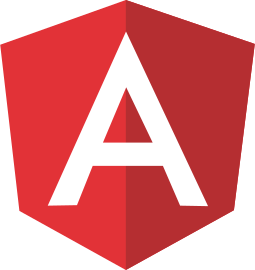

# [Alex Bleggi](https://alexbleggi.netlify.app/blog/welcome)

Hi there!!! I'm Alex and I'm a Front-end developer with 9 years of experience in web development and an **UI/UX/Design System** development enthusiast, currently living in Brazil.

  
  
  
  
  

 

> For more information check out my **[website](https://alexbleggi.netlify.app/)**!!!

### Currently studying:

  

### Currently working with:

  
  
  
  
  
  

### Most used languages:

<b>🔥 Click to show the list:</b>

 

## [Knowledge](https://alexbleggi.netlify.app/knowledge)

A list of tools and technologies with which I have knowledge and experience.

<b>🔥 Click to show the list:</b>

### Core

  
  
  
  
  

### JavaScript Compilers/Libraries/Frameworks

  
  
  
  
  
  
  

### CSS Processors

  
  
  
  

### Build Tools/Bundlers

  
  
  
  
  
  
  

### HTTP Clients

  

### Monorepos

  

### Linters

  
  
  
  

### Animation Libraries/Frameworks

  
  

### UI Libraries/Frameworks

  
  

### Methodologies/Guidelines

  
  

### Documentation

  
  
  

### Design Tools

  
  
  

### [...more](https://alexbleggi.netlify.app/knowledge)

## [Courses](https://alexbleggi.netlify.app/courses)

A list of courses I took.

<b>🔥 Click to show the list:</b>

 

- **[JavaScript Unit Testing](https://www.udemy.com/course/javascript-unit-testing-the-practical-guide)** by **[Academind](https://www.udemy.com/user/academind/)** on **[Udemy](https://www.udemy.com/)**.
- **[Angular the Complete Guide](https://www.udemy.com/course/the-complete-guide-to-angular-2)** by **[Academind](https://www.udemy.com/user/academind/)** on **[Udemy](https://www.udemy.com/)**.
- **[Vue the Complete Guide](https://www.udemy.com/course/vuejs-2-the-complete-guide)** by **[Academind](https://www.udemy.com/user/academind/)** on **[Udemy](https://www.udemy.com/)**.
- **[React the Complete Guide](https://www.udemy.com/course/react-the-complete-guide-incl-redux)** by **[Academind](https://www.udemy.com/user/academind/)** on **[Udemy](https://www.udemy.com/)**.
- **[Web Components and Stencil.js](https://www.udemy.com/course/web-components-stenciljs-build-custom-html-elements)** by **[Academind](https://www.udemy.com/user/academind/)** on **[Udemy](https://www.udemy.com/)**.
- **[Understanding TypeScript](https://www.udemy.com/course/understanding-typescript)** by **[Academind](https://www.udemy.com/user/academind/)** on **[Udemy](https://www.udemy.com/)**.
- **[The Complete JavaScript Course](https://www.udemy.com/course/the-complete-javascript-course)** by **[Jonas Schmedtmann](https://www.udemy.com/user/jonasschmedtmann/)** on **[Udemy](https://www.udemy.com/)**.
- **[Advanced CSS and Sass](https://www.udemy.com/course/advanced-css-and-sass)** by **[Jonas Schmedtmann](https://www.udemy.com/user/jonasschmedtmann/)** on **[Udemy](https://www.udemy.com/)**.
- **[Advanced Animations and Interactions with Ionic](https://www.joshmorony.com/advanced-animations-and-interactions-with-ionic/?utm_source=books)** by **[Josh Morony](https://www.joshmorony.com/about/)**.

## [Projects](https://alexbleggi.netlify.app/projects)

A list of personal and course projects.

<b>🔥 Click to show the list:</b>

